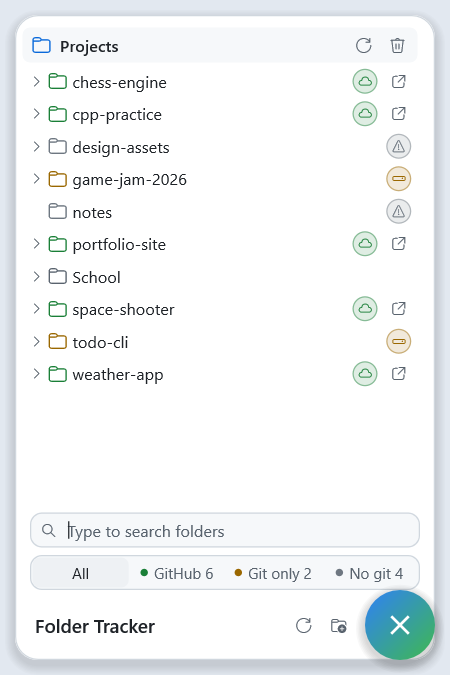

# Folder Tracker

A floating desktop bubble, written in C++ with plain Win32 + Direct2D. Click it and a small panel grows out of it, showing your project folders and whether each one is **on GitHub** (cloud), **git only** (drive), or has **no git** (warning). Uses about 6 MB of memory.

<p align="center"></p>

Works on Windows 10 and 11 (64-bit). The .exe needs nothing else installed. Windows may warn on first launch because the app is not signed: click **More info → Run anyway**.

- **Click** the bubble to open or close the panel. Clicking elsewhere or pressing Esc also closes it.
- **Drag** the bubble to move it. The panel always opens toward the middle of the screen.
- **Type** while the panel is open to search. Esc clears the search.
- **Right-click** the bubble (or the tray icon near the clock) for: hide bubble, start with Windows, quit.
- Opening the app again while it runs just opens the panel.

## Build

Needs a MinGW-w64 g++ (C++20), CMake and Ninja.

```
cmake -S . -B build -G Ninja
cmake --build build
```

The app is `build\Folder Tracker.exe`, a single file with nothing else needed. Quit the running app before rebuilding, or the build cannot replace the .exe.

Settings (added folders, bubble position) are saved in `%APPDATA%\Folder Tracker\settings.ini`.

## Where things are

```
src/
  main.cpp               start-up, one-instance-only check, message loop
  Messages.h             custom window messages
  core/                  no drawing here
    Scanner.cpp          walks folders and decides each folder's status
    ScanConfig.h         scan depth and ignored folders (node_modules, dist, ...)
    Git.cpp              finds .git and reads its remotes straight from .git/config
    Workspace.cpp        the added folders; runs scans on background threads
    FolderNode.h         the folder tree data
  platform/              talking to Windows
    Settings.cpp         settings.ini
    Shell.cpp            folder picker, open links, start with Windows
    Tray.cpp             tray icon
    AppMenu.cpp          right-click menu
  ui/
    Theme.h              colors, sizes, fonts, animation timing (change the look here)
    Icons.h              which icon goes where
    BubbleWindow.cpp     the floating window: dragging, clicks, keyboard, animation
    PanelView.cpp        draws the panel: header, tabs, search, folder tree
    BubbleArt.cpp        draws the round bubble
    Layout.cpp           where each part of the panel goes
    Painter.cpp          simple drawing commands (rectangles, circles, text, icons)
    LayeredSurface.cpp   the see-through window image
    Graphics.cpp         shared Direct2D / DirectWrite setup
resources/               app icon and version info
```
